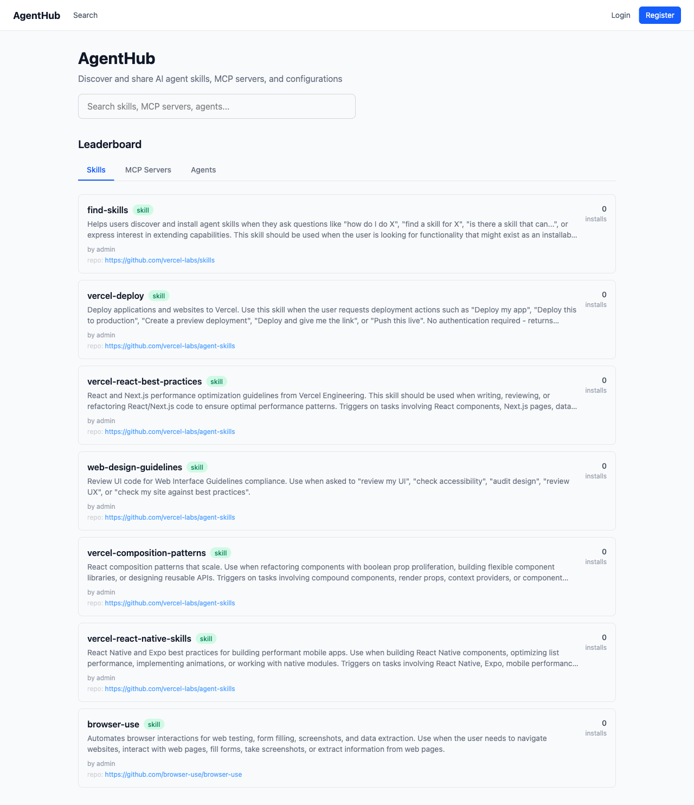
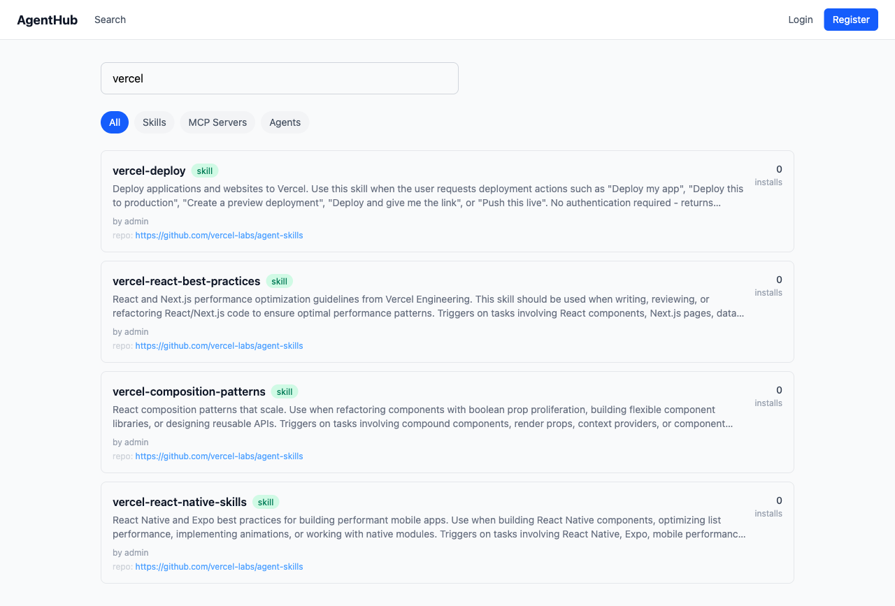
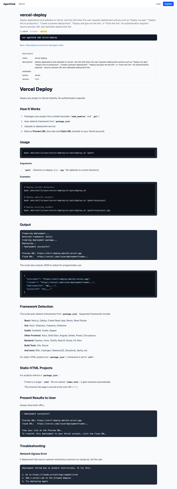
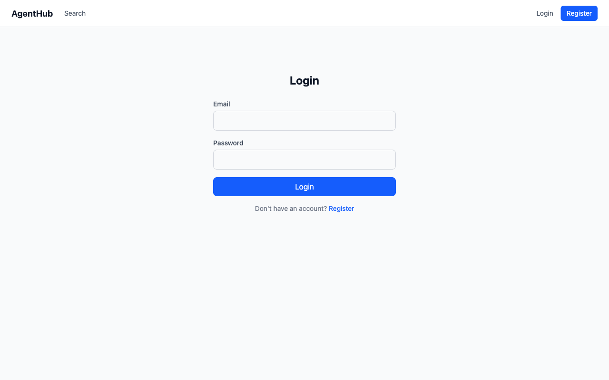
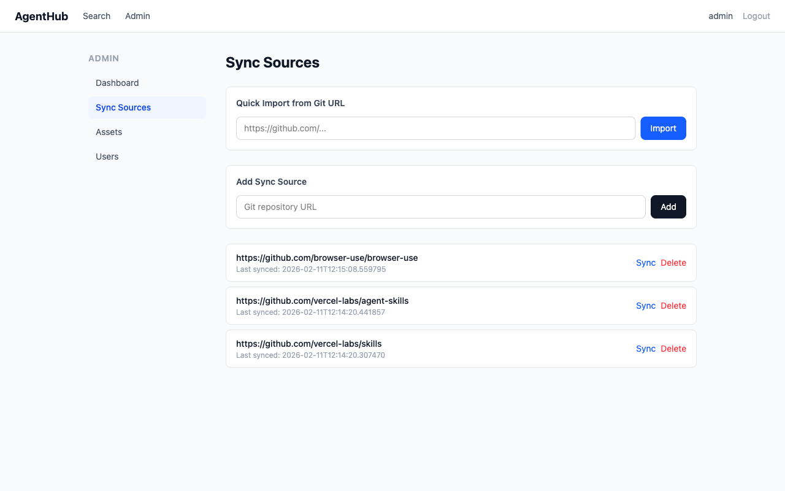
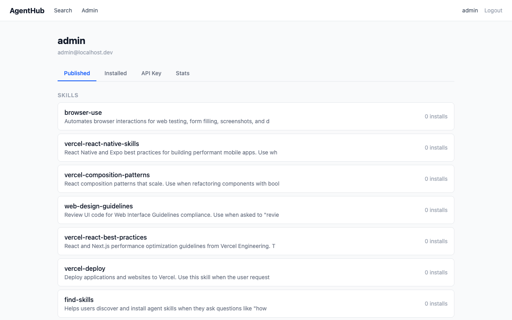

# AgentHub

A self-hosted registry platform for AI Agent assets — Skills, MCP Server configs, and Agent configs — with search, distribution, and one-click install.

## Features

- Three asset types: Skills, MCP Server configs (TBC), Agent configs (TBC)
- Web UI: search, browse, leaderboard, GitHub-style Markdown rendering
- CLI tool: zero-install via `uvx`, one-command search/install/publish
- External source import: sync Skills from GitHub / skills.sh repositories
- Multi-user: open registration, API Key management, profile center
- Admin portal: asset management, sync source management, user management
- Single-container Docker deployment, supports amd64 / arm64

> **Note:** MCP Server and Agent config sharing features are currently TBC (To Be Completed). The current release focuses on Skills registry and distribution.

## Screenshots

| Home & Leaderboard | Search |
|:---:|:---:|
|  |  |

| Skill Detail (GitHub-style Markdown) | Login |
|:---:|:---:|
|  |  |

| Admin Dashboard | Admin Sync Sources |
|:---:|:---:|
|  |  |

| Profile |
|:---:|
|  |

## Quick Start

### Docker (recommended)

```bash
docker run -d --name agenthub \
  -p 8000:8000 \
  -e SECRET_KEY=your-secret-key \
  -e ADMIN_API_KEY=sr_your-admin-key \
  -e ADMIN_USERNAME=admin \
  -e ADMIN_PASSWORD=your-password \
  -v agenthub-data:/app/backend/data \
  jief123/agenthub:latest
```

Open http://localhost:8000

### Docker Compose

```bash
cp .env.example .env
# Edit .env to set passwords and secrets
docker compose up -d
```

### Local Development

```bash
# Backend
pip install -e ./shared -e ./backend
cd backend
ADMIN_API_KEY=sr_test-key SECRET_KEY=dev-secret uvicorn app.main:app --reload --port 8000

# Frontend (separate terminal)
cd frontend && npm ci && npm run dev
```

## CLI

Run directly via `uvx` — no installation required:

```bash
# Configuration
uvx agenthub-cli config set registry.url http://localhost:8000
uvx agenthub-cli config set registry.api_key sr_your-api-key

# Search
uvx agenthub-cli find <keyword>

# Install a Skill
uvx agenthub-cli add <name>

# Publish a Skill (in a directory containing SKILL.md)
uvx agenthub-cli publish

# MCP Servers (TBC)
uvx agenthub-cli mcp list
uvx agenthub-cli mcp add <name>

# Agent configs (TBC)
uvx agenthub-cli agent list
uvx agenthub-cli agent add <name>

# View installed assets
uvx agenthub-cli list
```

## Authentication

The platform supports three authentication methods:

- **JWT Token** (frontend): issued on login, valid for 24h, stored in browser localStorage
- **API Key** (CLI / API): generated on registration, can be regenerated in profile, passed via `X-API-Key` header
- **Admin Key** (env variable): configured via `ADMIN_API_KEY`, always valid, unaffected by frontend login

## Environment Variables

| Variable | Description | Default |
|----------|-------------|---------|
| `DATABASE_URL` | Database connection | `sqlite+aiosqlite:///./skills_registry.db` |
| `SECRET_KEY` | JWT signing secret | `change-me-in-production` |
| `ADMIN_API_KEY` | Admin API Key | - |
| `ADMIN_USERNAME` | Admin username | `admin` |
| `ADMIN_PASSWORD` | Admin password | `admin123` |
| `ADMIN_EMAIL` | Admin email | `admin@localhost.dev` |
| `SYNC_ENABLED` | Enable background sync | `false` |
| `SYNC_INTERVAL` | Sync interval (seconds) | `86400` |
| `LOG_LEVEL` | Log level | `INFO` |

## Project Structure

```
agenthub/
├── shared/       # Shared library (schemas, adapters, parsers)
├── backend/      # FastAPI backend
├── frontend/     # React + Tailwind frontend
├── cli/          # CLI tool (PyPI: agenthub-cli)
├── Dockerfile    # Multi-stage build (frontend + backend)
├── docker-compose.yml
└── aidlc-docs/   # Design documentation
```

## Tech Stack

- Backend: Python 3.12 + FastAPI + SQLAlchemy (async) + SQLite/PostgreSQL
- Frontend: React + Vite + Tailwind CSS
- CLI: Python + Typer + Rich
- Auth: JWT (PyJWT) + API Key (bcrypt)
- Deployment: Docker (multi-arch: amd64/arm64)

## Distribution

- Docker Hub: `jief123/agenthub`
- PyPI: `agenthub-cli`

---


# AgentHub（中文）

企业私有化 AI Agent 资产（Skills / MCP Server 配置 / Agent 配置）注册、搜索与分发平台。

## 特性

- 三类资产管理：Skills、MCP Server 配置（TBC）、Agent 配置（TBC）
- Web UI：搜索、浏览、Leaderboard、GitHub-style Markdown 渲染
- CLI 工具：通过 `uvx` 零安装运行，一键搜索/安装/发布
- 外部源导入：从 GitHub / skills.sh 导入公开 Skills
- 多用户：开放注册、API Key 管理、个人中心
- Admin Portal：资产管理、同步源管理、用户管理
- Docker 一键部署，支持 amd64 / arm64

> **注意：** MCP Server 和 Agent 配置的共享功能目前属于 TBC（待完成）。当前版本主要支持 Skills 的注册与分发。

## 截图

| 首页 & 排行榜 | 搜索 |
|:---:|:---:|
|  |  |

| Skill 详情（GitHub 风格 Markdown） | 登录 |
|:---:|:---:|
|  |  |

| 管理后台 | 同步源管理 |
|:---:|:---:|
|  |  |

| 个人中心 |
|:---:|
|  |

## 快速开始

### Docker（推荐）

```bash
docker run -d --name agenthub \
  -p 8000:8000 \
  -e SECRET_KEY=your-secret-key \
  -e ADMIN_API_KEY=sr_your-admin-key \
  -e ADMIN_USERNAME=admin \
  -e ADMIN_PASSWORD=your-password \
  -v agenthub-data:/app/backend/data \
  jief123/agenthub:latest
```

访问 http://localhost:8000

### Docker Compose

```bash
cp .env.example .env
# 编辑 .env 设置密码和密钥
docker compose up -d
```

### 本地开发

```bash
# 后端
pip install -e ./shared -e ./backend
cd backend
ADMIN_API_KEY=sr_test-key SECRET_KEY=dev-secret uvicorn app.main:app --reload --port 8000

# 前端（另一个终端）
cd frontend && npm ci && npm run dev
```

## CLI

通过 `uvx` 直接运行，无需安装：

```bash
# 配置
uvx agenthub-cli config set registry.url http://localhost:8000
uvx agenthub-cli config set registry.api_key sr_your-api-key

# 搜索
uvx agenthub-cli find <keyword>

# 安装 Skill
uvx agenthub-cli add <name>

# 发布 Skill（在包含 SKILL.md 的目录下）
uvx agenthub-cli publish

# MCP Server（TBC）
uvx agenthub-cli mcp list
uvx agenthub-cli mcp add <name>

# Agent 配置（TBC）
uvx agenthub-cli agent list
uvx agenthub-cli agent add <name>

# 查看已安装
uvx agenthub-cli list
```

## 认证

平台支持三种认证方式：

- **JWT Token**（前端）：登录后自动获取，24h 有效，存于浏览器 localStorage
- **API Key**（CLI / API）：注册时生成，可在个人中心重新生成，通过 `X-API-Key` header 传递
- **Admin Key**（环境变量）：`ADMIN_API_KEY` 环境变量配置，永久有效，不受前端登录影响

## 环境变量

| 变量 | 说明 | 默认值 |
|------|------|--------|
| `DATABASE_URL` | 数据库连接 | `sqlite+aiosqlite:///./skills_registry.db` |
| `SECRET_KEY` | JWT 签名密钥 | `change-me-in-production` |
| `ADMIN_API_KEY` | Admin API Key | - |
| `ADMIN_USERNAME` | Admin 用户名 | `admin` |
| `ADMIN_PASSWORD` | Admin 密码 | `admin123` |
| `ADMIN_EMAIL` | Admin 邮箱 | `admin@localhost.dev` |
| `SYNC_ENABLED` | 启用后台同步 | `false` |
| `SYNC_INTERVAL` | 同步间隔（秒） | `86400` |
| `LOG_LEVEL` | 日志级别 | `INFO` |

## 项目结构

```
agenthub/
├── shared/       # 共享库（schemas, adapters, parsers）
├── backend/      # FastAPI 后端
├── frontend/     # React + Tailwind 前端
├── cli/          # CLI 工具（PyPI: agenthub-cli）
├── Dockerfile    # 多阶段构建（前端 + 后端）
├── docker-compose.yml
└── aidlc-docs/   # 设计文档
```

## 技术栈

- 后端：Python 3.12 + FastAPI + SQLAlchemy (async) + SQLite/PostgreSQL
- 前端：React + Vite + Tailwind CSS
- CLI：Python + Typer + Rich
- 认证：JWT (PyJWT) + API Key (bcrypt)
- 部署：Docker (multi-arch: amd64/arm64)

## 发布

- Docker Hub: `jief123/agenthub`
- PyPI: `agenthub-cli`


