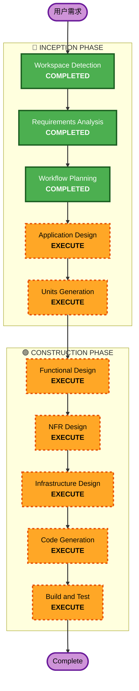

# Execution Plan

## 详细分析摘要

### 变更影响评估
- **用户侧变更**: Yes — 全新平台，包含 Web UI、CLI、API
- **结构性变更**: Yes — 全新系统架构（前端 + 后端 + CLI + 数据库）
- **数据模型变更**: Yes — 全新数据库设计（Skill, MCPServer, AgentConfig, User, InstallLog）
- **API 变更**: Yes — 全新 RESTful API 设计
- **NFR 影响**: Yes — 认证、性能、部署、兼容性均有明确要求

### 风险评估
- **风险等级**: Medium
- **回滚复杂度**: Low（Greenfield，无历史包袱）
- **测试复杂度**: Moderate（多组件集成：Web + API + CLI + Git 适配 + Agent Adapter）

## 工作流可视化

## 阶段执行计划

### 🔵 INCEPTION PHASE
- [x] Workspace Detection (COMPLETED)
- [x] Requirements Analysis (COMPLETED) — 两轮问答，需求已确认
- [x] Workflow Planning (COMPLETED)
- [ ] User Stories — **SKIP**
  - **理由**: 单组织内部工具，用户角色简单（developer / admin），需求文档已包含足够的用户视角描述
- [x] Application Design — **COMPLETED**
  - **理由**: 全新系统，需要定义组件架构、API 设计、Agent Adapter 接口、模块划分
- [x] Units Generation — **COMPLETED**
  - **理由**: 多组件系统（Backend API / Frontend / CLI / Database），需要拆分为可独立实现的工作单元

### 🟢 CONSTRUCTION PHASE
- [x] Functional Design — **COMPLETED**
  - **理由**: 每个 Unit 需要详细的接口定义、数据流、业务逻辑设计
- [ ] NFR Requirements — **SKIP**（已在需求文档中定义）
- [x] NFR Design — **COMPLETED**
  - **理由**: 认证方案（API Key）、Docker 部署、性能优化需要具体设计
- [x] Infrastructure Design — **COMPLETED**
  - **理由**: Docker Compose 编排、PostgreSQL 配置、前后端容器化方案
- [x] Code Generation — **COMPLETED**
  - **理由**: 核心交付物
- [x] Build and Test — **COMPLETED**
  - **理由**: 确保可运行

### 🟡 OPERATIONS PHASE
- [ ] Operations — PLACEHOLDER（不在本项目范围）

## 执行顺序

| 序号 | 阶段 | 产出物 |
|------|------|--------|
| 1 | Application Design | 系统架构图、组件定义、API 设计、Agent Adapter 接口、数据模型详细设计 |
| 2 | Units Generation | 工作单元拆分（Backend API / Frontend / CLI / DB Migration / Docker） |
| 3 | Functional Design (per unit) | 每个 Unit 的详细接口、数据流、业务逻辑 |
| 4 | NFR Design | 认证实现方案、Docker 部署方案、性能设计 |
| 5 | Infrastructure Design | Docker Compose 配置、数据库初始化、环境变量管理 |
| 6 | Code Generation (per unit) | 源代码实现 |
| 7 | Build and Test | 构建验证、集成测试 |

## 成功标准
- **主要目标**: 可通过 `docker compose up` 一键启动的完整平台
- **关键交付物**:
  - FastAPI 后端（RESTful API + OpenAPI 文档）
  - React 前端（列表、搜索、详情、管理后台）
  - Python CLI（uvx 分发，支持 Skills / MCP / Agent 的注册和安装）
  - PostgreSQL 数据库（含迁移脚本）
  - Docker Compose 部署配置
  - Kiro Adapter 实现（IDE + CLI 差异处理）
- **质量门禁**:
  - API 端点可通过 Swagger UI 测试
  - CLI 核心命令可正常执行
  - Web UI 可正常浏览和搜索
  - Docker Compose 一键启动成功
